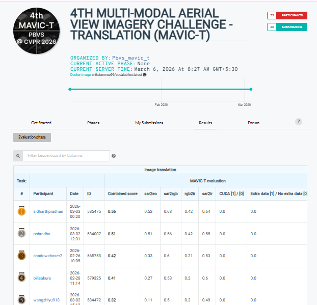

# MAVIC-T: Multi-Domain Aerial View Image Translation

### Rank 1 Winner — PBVS 2026 MAVIC-T Challenge @ CVPR 2026

[](LICENSE)
[](https://www.python.org/)
[](https://pytorch.org/)
[](https://cvpr.thecvf.com/)

This repository contains the **winning solution (Rank 1)** for the [PBVS 2026 MAVIC-T (Multi-domain Aerial View Image Challenge — Translation)](https://pbvs-workshop.github.io/) held at CVPR 2026. The challenge required translating aerial imagery across four distinct domain pairs:

| Sub-task | Source | Target | Approach |
|----------|--------|--------|----------|
| SAR → EO | Synthetic Aperture Radar | Electro-Optical | Conditional U-Net GAN |
| RGB → IR | Visible RGB | Infrared | Variance-Weighted Fusion + CLAHE |
| SAR → RGB | Synthetic Aperture Radar | Visible RGB | Adaptive Histogram Transfer |
| SAR → IR | Synthetic Aperture Radar | Infrared | Adaptive Histogram Transfer |

---

## Table of Contents

- [Overview](#overview)
- [Repository Structure](#repository-structure)
- [Method](#method)
  - [Preprocessing — SpeckleFilterBank](#preprocessing--specklefilterbank)
  - [SAR to EO — Conditional U-Net GAN](#sar-to-eo--conditional-u-net-gan)
  - [RGB to IR — Channel Fusion Pipeline](#rgb-to-ir--channel-fusion-pipeline)
  - [SAR to RGB and SAR to IR — Adaptive Histogram Transfer](#sar-to-rgb-and-sar-to-ir--adaptive-histogram-transfer)
- [Installation](#installation)
- [Data Preparation](#data-preparation)
- [Training](#training)
- [Inference](#inference)
- [Submission Packaging](#submission-packaging)
- [Results](#results)
- [Hardware and Software Specifications](#hardware-and-software-specifications)
- [Citation](#citation)
- [License](#license)
- [Acknowledgements](#acknowledgements)

---

## Overview

The MAVIC-T challenge evaluates cross-modal aerial image translation across four domain pairs. Our approach combines a learned conditional GAN for the SAR-to-EO task (where paired training data is available) with carefully designed signal-processing pipelines for the remaining three tasks (where no paired training data exists).

A key component shared across all SAR-input tasks is the **SpeckleFilterBank** — a three-stage adaptive denoising pipeline that suppresses multiplicative speckle noise while preserving structural edges. This preprocessing step is applied consistently during both training and inference.

---

## Repository Structure

```
pbvs-mavic-2026/
├── configs/
│   └── default.yaml                 # Training and inference hyperparameters
├── src/
│   ├── preprocessing/
│   │   └── speckle_filter.py        # SpeckleFilterBank (Lee + bilateral + CoV blend)
│   ├── models/
│   │   ├── generator.py             # 8-level U-Net generator (~54.4M params)
│   │   └── discriminator.py         # Lightweight 2-layer PatchGAN discriminator
│   ├── datasets/
│   │   └── mavic_dataset.py         # Paired SAR/EO dataset loader
│   └── postprocessing/
│       ├── gamma_correction.py      # Adaptive gamma correction for EO outputs
│       ├── histogram_transfer.py    # Two-pass CDF matching + bilateral residual
│       └── channel_fusion.py        # Inverse-variance RGB fusion + CLAHE
├── train.py                         # Training script for SAR -> EO GAN
├── inference.py                     # Inference for all four sub-tasks
├── package_submission.py            # Output verification + ZIP packaging
├── requirements.txt                 # Python dependencies
├── configs/default.yaml             # Default configuration
├── LICENSE                          # MIT License
└── README.md
```

---

## Method

### Preprocessing — SpeckleFilterBank

SAR imagery contains multiplicative speckle noise caused by coherent wave superposition. Our **SpeckleFilterBank** applies a three-stage adaptive pipeline to every SAR image:

```
SAR image
    │
    ├─► Stage 1: Lee-approximation filter (7×7 local statistics)
    │       w = σ² / (σ² + η²·μ²)  →  I_lee = μ + w·(I − μ)
    │
    ├─► Stage 2: Bilateral filter (edge-preserving spatial smoothing)
    │       bilateral(d=9, σ_color=75, σ_space=75)
    │
    └─► Stage 3: CoV-weighted adaptive blend
            α = CoV / max(CoV) ∈ [0, 1]
            I_out = α · I_lee + (1 − α) · I_bilateral
```

- **High-CoV regions** (textured / edges): The Lee output is preferred, preserving structural detail.
- **Low-CoV regions** (homogeneous / flat): The bilateral output is preferred, providing stronger smoothing.

This filter is applied consistently at both training and inference time.

### SAR to EO — Conditional U-Net GAN

The SAR-to-EO task uses paired training data (68,151 matched image pairs) to train a conditional GAN following the pix2pix framework:

**Generator — `SARToEOGenerator` (~54.4M parameters)**

An 8-level encoder-decoder with symmetric skip connections:

| Encoder | Decoder |
|---------|---------|
| D1: Conv(1→64) + LeakyReLU | U7: ConvT(256→64) + skip D1 |
| D2: Conv(64→128) + IN + LeakyReLU | U6: ConvT(512→128) + skip D2 |
| D3: Conv(128→256) + IN + LeakyReLU | U5: ConvT(1024→256) + skip D3 |
| D4: Conv(256→512) + IN + LeakyReLU | U4: ConvT(1024→512) + skip D4 |
| D5-D7: Conv(512→512) + IN + LeakyReLU | U1-U3: ConvT(1024→512) + Dropout(0.5) + skip |
| D8: Conv(512→512) — bottleneck | Output: ConvT(128→1) + Tanh |

**Discriminator — `SARToEODiscriminator`**

A lightweight 2-layer PatchGAN receiving the concatenated SAR + EO pair (2 channels).

**Loss Functions**

- Discriminator: LSGAN MSE loss — `0.5 × (MSE(D(real), 1) + MSE(D(fake), 0))`
- Generator: `MSE(D(fake), 1) + 100 × L1(fake, real_EO)`

**Post-processing**: Adaptive gamma correction drives each output image's mean luminance toward 128 (mid-grey), using a per-image analytically computed gamma clamped to [0.6, 1.8].

### RGB to IR — Channel Fusion Pipeline

This task has no paired training data. A signal-processing pipeline is used:

1. **Variance-weighted channel fusion**: RGB channels are fused with per-image inverse-variance weights (channels with lower variance get higher weight).
2. **Water/sky suppression**: Pixels with high blue ratio and low luminance are attenuated by 0.5.
3. **CLAHE**: Contrast-Limited Adaptive Histogram Equalisation (8×8 tiles, clip limit 2.0) enhances local contrast without amplifying noise.

### SAR to RGB and SAR to IR — Adaptive Histogram Transfer

Both tasks use a two-pass adaptive histogram transfer:

```
Pass 1:  I_p1  = CDF_match(source → reference)         [global tone alignment]
Pass 2:  R     = source − I_p1                          [residual = lost detail]
         R_bil = bilateral_filter(R)                    [edge-preserving smooth]
         I_out = I_p1 + α · R_bil        (α = 0.25)    [blend back structure]
```

Reference pixel distributions are collected from UC Davis aerial imagery (when available). SpeckleFilterBank is applied to the SAR input before histogram transfer.

---

## Installation

```bash
# Clone the repository
git clone https://github.com/SidharthKumarPradhan/pbvs-mavic-2026.git
cd pbvs-mavic-2026

# Create a virtual environment (recommended)
python -m venv venv
source venv/bin/activate        # Linux / macOS
venv\Scripts\activate           # Windows

# Install dependencies
pip install -r requirements.txt
```

**Python version**: 3.10 or later is recommended.

**GPU**: A CUDA-capable GPU is required for training.  Inference runs on both CPU and GPU.

---

## Data Preparation

Download the challenge data from [CodaBench](https://www.codabench.org/) and organise it as follows:

```
data/
├── train/
│   └── sar2eo/
│       ├── sar/          # SAR training images (*.png or *.tiff)
│       └── eo/           # EO training images (matched filenames)
├── test/
│   ├── sar2eo/           # 3,586 SAR test images (*.png)
│   ├── sar2rgb/          # 60 SAR test images (*.tiff)
│   ├── sar2ir/           # 60 SAR test images (*.tiff)
│   └── rgb2ir/           # 60 RGB test images (*.tiff)
└── uc_davis/             # (Optional) UC Davis reference imagery for histogram transfer
    ├── location_1/
    │   ├── *rgb*.tiff
    │   └── *ir*.tiff
    └── ...
```

---

## Training

Train the SAR-to-EO generator (the only learned component):

```bash
python train.py \
    --sar_dir data/train/sar2eo/sar \
    --eo_dir  data/train/sar2eo/eo \
    --epochs 5 \
    --batch_size 16 \
    --output_dir weights
```

**Key training parameters** (matching the winning configuration):

| Parameter | Value |
|-----------|-------|
| Optimiser | Adam (β₁=0.5, β₂=0.999) |
| LR Generator | 2 × 10⁻⁴ |
| LR Discriminator | 1 × 10⁻⁴ |
| LR Schedule | CosineAnnealingWarmRestarts (T₀=2) |
| Gradient clipping | max_norm = 1.0 |
| Batch size | 16 |
| Epochs | 5 |
| Image size | 256 × 256 |
| L1 weight (λ) | 100 |

Checkpoints are saved after every epoch to the `weights/` directory.

---

## Inference

Run inference on all four sub-tasks at once:

```bash
python inference.py \
    --test_dir data/test \
    --weights weights/sar2eo_final.pth \
    --output_dir submission \
    --uc_davis_dir data/uc_davis
```

This produces:

```
submission/
├── sar2eo/    3,586 PNG files  (256×256, RGB)
├── sar2rgb/      60 TIFF files (256×256, RGB)
├── sar2ir/       60 TIFF files (256×256, RGB)
└── rgb2ir/       60 TIFF files (256×256, RGB)
```

If UC Davis reference imagery is not available, SAR → RGB and SAR → IR fall back to direct channel replication.

---

## Submission Packaging

Verify outputs and create the CodaBench-compatible ZIP:

```bash
python package_submission.py \
    --submission_dir submission \
    --output_zip submission.zip
```

The output ZIP structure matches the competition requirements:

```
submission.zip
├── readme.txt          # Runtime and method metadata
├── sar2eo/   *.png     (256×256, RGB, 3586 files)
├── sar2rgb/  *.tiff    (256×256, RGB,   60 files)
├── sar2ir/   *.tiff    (256×256, RGB,   60 files)
└── rgb2ir/   *.tiff    (256×256, RGB,   60 files)
```

---

## Results

Our solution achieved **Rank 1** on the official PBVS 2026 MAVIC-T CodaBench leaderboard.

<p align="center">
  
  <br>
  <em>Rank 1 — PBVS 2026 MAVIC-T Challenge @ CVPR 2026</em>
</p>

| Sub-task | Method | Model Params |
|----------|--------|-------------|
| SAR → EO | Conditional U-Net GAN | 54.4M |
| RGB → IR | Variance-Weighted Fusion + CLAHE | — (signal processing) |
| SAR → RGB | Adaptive Histogram Transfer | — (signal processing) |
| SAR → IR | Adaptive Histogram Transfer | — (signal processing) |

**Runtime**: ~0.05 seconds per image on GPU.

---

## Hardware and Software Specifications

| Component | Specification |
|-----------|---------------|
| GPU | NVIDIA T4 (Google Colab) |
| RAM | 12 GB (Colab standard) |
| Programming language | Python 3.10 |
| Deep learning framework | PyTorch 2.0+ |
| Image processing | OpenCV 4.8+, Pillow 10+, rasterio 1.3+ |
| Training time | ~5 epochs on 68,151 pairs |

---

## Citation

If you find this work useful in your research, please consider citing:

```bibtex
@inproceedings{pradhan2026mavict,
  title     = {Rank-1 Solution to the PBVS 2026 MAVIC-T Challenge: Conditional U-Net GAN
               with Adaptive Speckle Suppression for Multi-Domain Aerial Image Translation},
  author    = {Pradhan, Sidharth Kumar},
  booktitle = {Proceedings of the IEEE/CVF Conference on Computer Vision and Pattern
               Recognition (CVPR) Workshops},
  year      = {2026}
}
```

---

## License

This project is licensed under the MIT License — see the [LICENSE](LICENSE) file for details.

---

## Acknowledgements

- The [PBVS Workshop](https://pbvs-workshop.github.io/) organisers for hosting the MAVIC-T challenge.
- The pix2pix framework ([Isola et al., 2017](https://arxiv.org/abs/1611.07004)) for the foundational conditional GAN design.
- UC Davis for providing reference aerial imagery used in histogram transfer.
